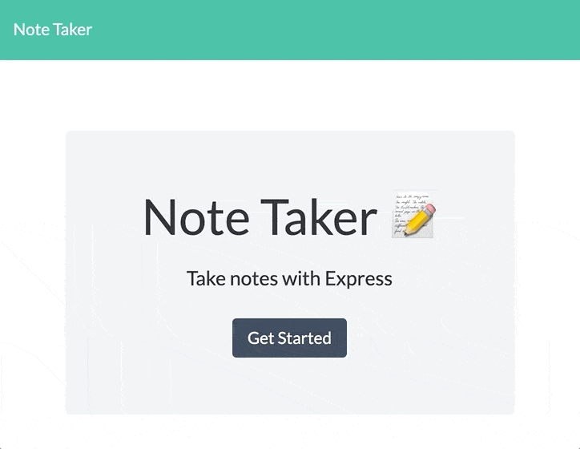

# 11-note-taker
## Unit 11 Express Homework: Note Taker

A note taking app demonstrating [Express](https://expressjs.com/) and [Node.js](https://nodejs.org/en/) deployed on [Heroku](https://www.heroku.com/).

Live site: [https://ocp-note-taker.herokuapp.com/](https://ocp-note-taker.herokuapp.com/)

## Use
Create a new note using the Pencil icon.  
Save the note using the Disk icon.  
Delete a note using its Trash icon.  